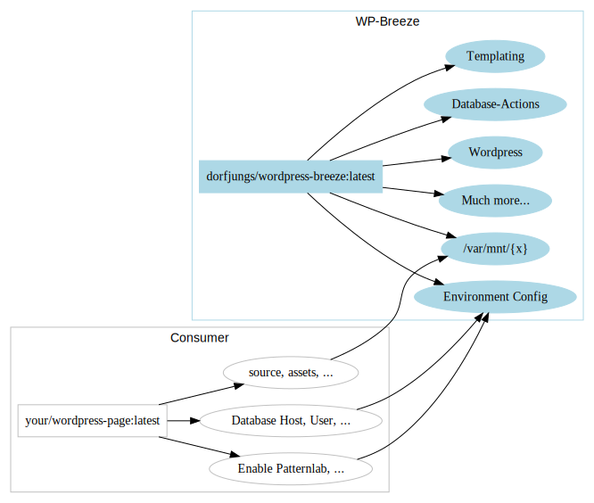

# Docker
You are simply using a docker container named `dorfjungs/wordpress-breeze` as parent for both, production and development.

## Data-Flow
This is how data and configuration gets transmitted to the parent container (`dorfjungs/wordpress-breeze`):
